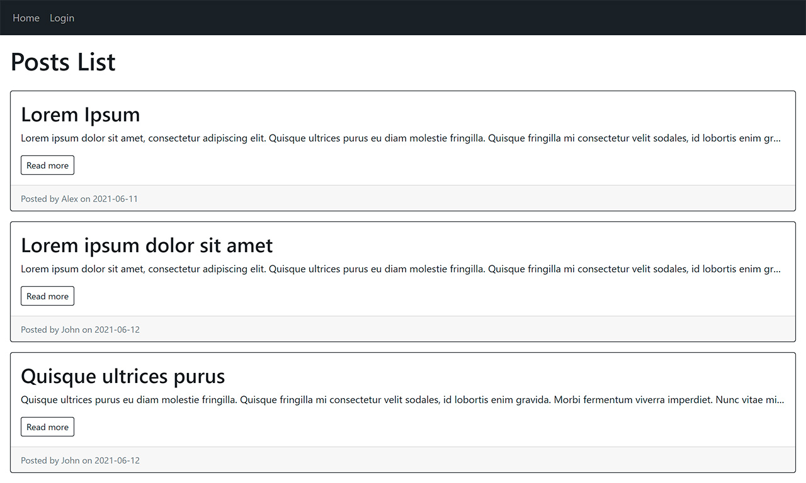
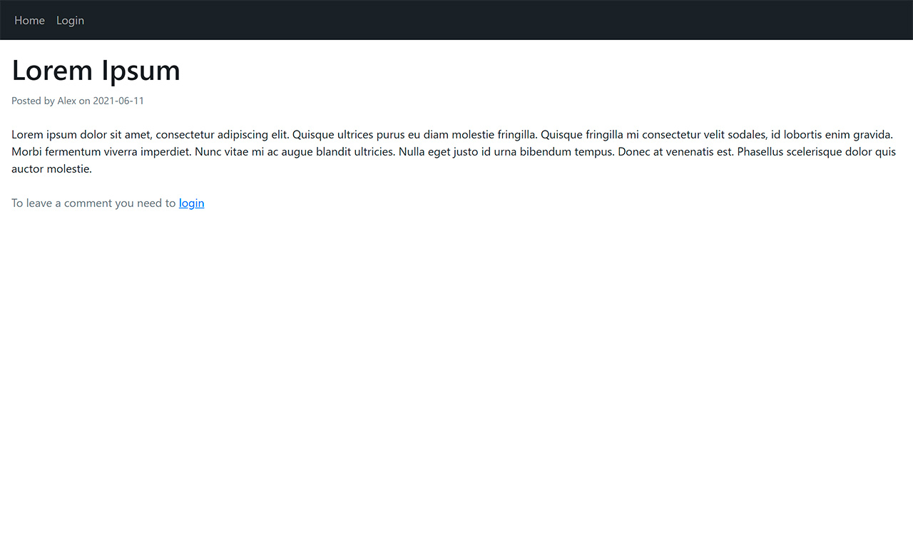
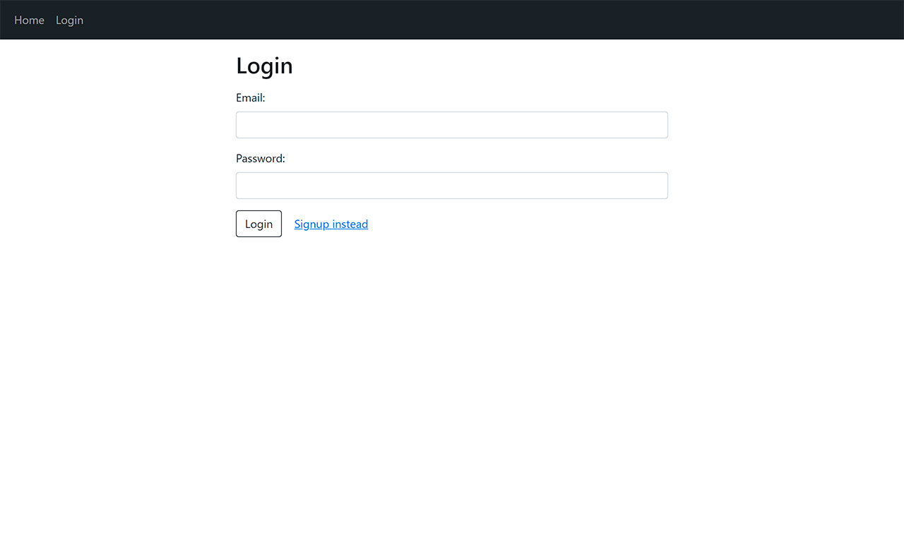
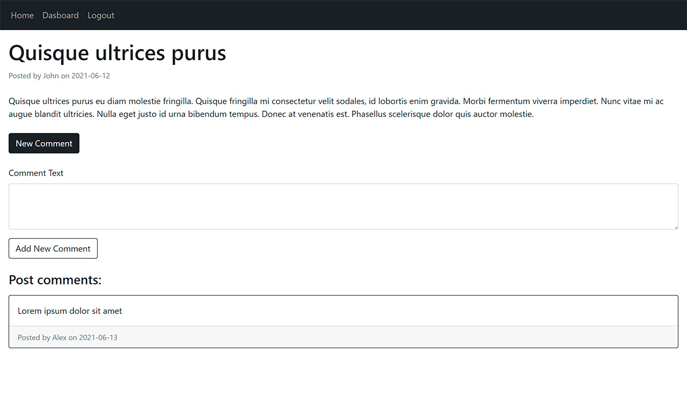

# Tech Blog

Link to deployed application - https://alex-tech-blog.herokuapp.com/

## Description
This application is simple blog, that allows you to view, create, delete, edit posts. To be able to create/delete/edit your posts in dashboard you should create account and be logged in. Also when you logged in you can add comments to all posts.

## Installation
To be able to use the application you need to install the necessary `npm modules`. You can do this by running the command 

```bash
npm install
```

in the root folder of the project.

The application used MySQL database. You can found a [schema.sql](./db/schema.sql) file in project folder for database creation example and [application models](./models) are represent database tables.

You should add configuration data `.env` file about your database connection to run application localy. File structure:

```
DB_USER='username'
DB_PASSWORD='yourpassword'
DB_NAME='tech_blog_db'
```

For adding test data to database you can run the command:

```bash
npm run seed
```

## Usage
To run application localy use this command from root folder:

```bash
npm start
```

After launch, the local application will be available via the link - http://localhost:3001/.

## Previews
Home page:



Post page without logged in:



Login page:



Signup page:

.jpg)

Dashboard page:


Post page after logged in:




## Credits
Author [Oleksandr Kulyk](https://github.com/AlexKuWerz)

Packages used:
- [Express.js](https://www.npmjs.com/package/express)
- [Handlebars](https://www.npmjs.com/package/express-handlebars)
- [Mysql2](https://www.npmjs.com/package/mysql2)
- [Sequelize](https://www.npmjs.com/package/sequelize)
- [Connect Session Sequelize](https://www.npmjs.com/package/connect-session-sequelize)
- [Express Session](https://www.npmjs.com/package/express-session)
- [Dotenv](https://www.npmjs.com/package/dotenv)
- [bcrypt](https://www.npmjs.com/package/bcrypt)
